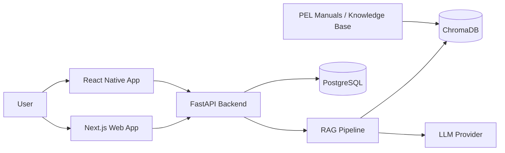

# PEL Product Knowledge Agent

> A multi-platform RAG system for appliance support, technical lookup, and product knowledge retrieval.

The **PEL Product Knowledge Agent** turns appliance manuals and technical documentation into a searchable AI assistant for both customers and technical users. Instead of forcing users to navigate fragmented PDFs or product pages, the system retrieves relevant source material and adapts the depth of its answer to the question being asked.

## Why this project matters

This project is not a chat UI wrapped around an LLM. It is an end-to-end software system spanning document retrieval, backend APIs, persistence, web, mobile, containerized infrastructure, and automated verification.

### Core capabilities

- Retrieval-Augmented Generation over appliance manuals and technical documents
- FastAPI backend with PostgreSQL persistence and Alembic migrations
- ChromaDB vector store for semantic retrieval
- Next.js web application for browser-based access
- React Native / Expo mobile client
- Docker Compose development environment
- Pytest-based backend verification
- Shared design and architecture documentation

## Architecture



## Repository structure

```text
PEL-Product-Knowledge-Agent/
├── backend/       # FastAPI, RAG pipeline, database, tests
├── web-app/       # Next.js + TypeScript web client
├── android-app/   # React Native / Expo mobile client
├── docs/          # Architecture and project documentation
├── Design.md      # Design-system and UI guidance
└── docker-compose.yml
```

## Technology stack

| Layer | Technologies |
|---|---|
| AI / Retrieval | RAG, ChromaDB, LLM integration |
| Backend | Python, FastAPI, PostgreSQL, Alembic |
| Web | Next.js, TypeScript, Tailwind CSS |
| Mobile | React Native, Expo |
| Infrastructure | Docker, Docker Compose |
| Verification | Pytest |

## Engineering decisions

**One backend, multiple clients.** The retrieval and application logic live behind one API so the web and mobile clients share the same source of truth.

**Retrieval before generation.** Product answers are grounded in indexed technical material rather than relying on an LLM's general memory.

**Explicit persistence and migrations.** PostgreSQL and Alembic keep application data and schema changes reproducible.

**Containerized local setup.** The backend stack can be brought up consistently without manually configuring each service.

## Run locally

### Backend

```bash
docker compose up -d --build
```

### Web

```bash
cd web-app
npm install
npm run dev
```

### Mobile

```bash
cd android-app
npm install
npm start
```

### Windows automated setup

```powershell
.\start-all.ps1
```

## Verification

```bash
cd backend
pytest
```

## Documentation

Technical notes, architectural decisions, and project scopes are maintained in [`docs/`](docs/). Source documents used by the retrieval pipeline live under `backend/documents/`.

---

Built as an applied AI systems project: retrieval, backend engineering, data persistence, product interfaces, and deployment concerns in one codebase.